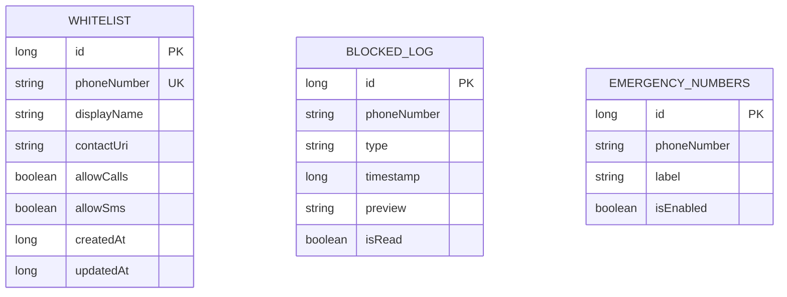
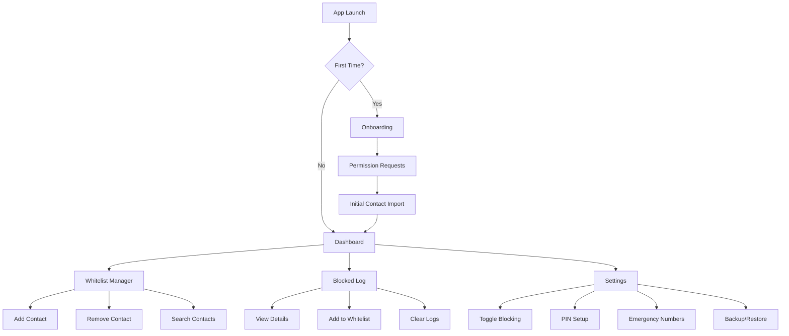

# Design Document
## SafeGuard - Technical Architecture

**Version:** 1.0  
**Date:** January 31, 2026  
**Status:** Draft

---

## 1. Tech Stack Overview

### Why This Stack?

| Technology | Rationale |
|------------|-----------|
| **Kotlin** | Modern, concise, null-safe, official Android language |
| **Jetpack Compose** | Declarative UI, less boilerplate, beautiful Material Design 3 support |
| **Room Database** | Type-safe SQLite, works seamlessly with Kotlin coroutines |
| **Hilt** | Simple dependency injection, officially recommended |
| **Material Design 3** | Modern aesthetics, dynamic theming, accessibility built-in |
| **Kotlin Coroutines** | Elegant async programming, perfect for background operations |

```
┌─────────────────────────────────────────────────────────────┐
│                      PRESENTATION LAYER                      │
│  ┌─────────────────┐  ┌─────────────────┐  ┌──────────────┐ │
│  │   Compose UI    │  │   ViewModels    │  │  UI States   │ │
│  └─────────────────┘  └─────────────────┘  └──────────────┘ │
├─────────────────────────────────────────────────────────────┤
│                       DOMAIN LAYER                           │
│  ┌─────────────────┐  ┌─────────────────┐  ┌──────────────┐ │
│  │   Use Cases     │  │    Entities     │  │  Repository  │ │
│  │                 │  │                 │  │  Interfaces  │ │
│  └─────────────────┘  └─────────────────┘  └──────────────┘ │
├─────────────────────────────────────────────────────────────┤
│                        DATA LAYER                            │
│  ┌─────────────────┐  ┌─────────────────┐  ┌──────────────┐ │
│  │  Room Database  │  │  Repositories   │  │ SharedPrefs  │ │
│  │     (Local)     │  │ (Implementation)│  │  DataStore   │ │
│  └─────────────────┘  └─────────────────┘  └──────────────┘ │
├─────────────────────────────────────────────────────────────┤
│                      SERVICES LAYER                          │
│  ┌─────────────────────────┐  ┌────────────────────────────┐│
│  │ CallScreeningService    │  │  SMS BroadcastReceiver     ││
│  │ (Intercepts Calls)      │  │  (Intercepts Messages)     ││
│  └─────────────────────────┘  └────────────────────────────┘│
└─────────────────────────────────────────────────────────────┘
```

---

## 2. Project Structure

```
app/
├── src/main/
│   ├── java/com/safeguard/
│   │   ├── SafeGuardApp.kt              # Application class
│   │   │
│   │   ├── data/                         # DATA LAYER
│   │   │   ├── local/
│   │   │   │   ├── AppDatabase.kt
│   │   │   │   ├── dao/
│   │   │   │   │   ├── WhitelistDao.kt
│   │   │   │   │   └── BlockedLogDao.kt
│   │   │   │   └── entity/
│   │   │   │       ├── WhitelistEntity.kt
│   │   │   │       └── BlockedLogEntity.kt
│   │   │   ├── repository/
│   │   │   │   ├── WhitelistRepositoryImpl.kt
│   │   │   │   └── BlockedLogRepositoryImpl.kt
│   │   │   └── preferences/
│   │   │       └── SettingsDataStore.kt
│   │   │
│   │   ├── domain/                       # DOMAIN LAYER
│   │   │   ├── model/
│   │   │   │   ├── WhitelistContact.kt
│   │   │   │   ├── BlockedLog.kt
│   │   │   │   └── AppSettings.kt
│   │   │   ├── repository/
│   │   │   │   ├── WhitelistRepository.kt
│   │   │   │   └── BlockedLogRepository.kt
│   │   │   └── usecase/
│   │   │       ├── AddToWhitelistUseCase.kt
│   │   │       ├── CheckWhitelistUseCase.kt
│   │   │       ├── LogBlockedCallUseCase.kt
│   │   │       └── GetBlockedLogsUseCase.kt
│   │   │
│   │   ├── presentation/                 # PRESENTATION LAYER
│   │   │   ├── MainActivity.kt
│   │   │   ├── navigation/
│   │   │   │   └── NavGraph.kt
│   │   │   ├── screens/
│   │   │   │   ├── dashboard/
│   │   │   │   │   ├── DashboardScreen.kt
│   │   │   │   │   └── DashboardViewModel.kt
│   │   │   │   ├── whitelist/
│   │   │   │   │   ├── WhitelistScreen.kt
│   │   │   │   │   └── WhitelistViewModel.kt
│   │   │   │   ├── blocked/
│   │   │   │   │   ├── BlockedLogScreen.kt
│   │   │   │   │   └── BlockedLogViewModel.kt
│   │   │   │   └── settings/
│   │   │   │       ├── SettingsScreen.kt
│   │   │   │       └── SettingsViewModel.kt
│   │   │   ├── components/
│   │   │   │   ├── ContactCard.kt
│   │   │   │   ├── BlockToggle.kt
│   │   │   │   └── StatCard.kt
│   │   │   └── theme/
│   │   │       ├── Theme.kt
│   │   │       ├── Color.kt
│   │   │       └── Typography.kt
│   │   │
│   │   ├── service/                      # ANDROID SERVICES
│   │   │   ├── SafeGuardCallScreeningService.kt
│   │   │   ├── SmsReceiver.kt
│   │   │   └── BootReceiver.kt
│   │   │
│   │   └── di/                           # DEPENDENCY INJECTION
│   │       ├── AppModule.kt
│   │       ├── DatabaseModule.kt
│   │       └── RepositoryModule.kt
│   │
│   └── res/
│       ├── values/
│       │   ├── colors.xml
│       │   ├── strings.xml
│       │   └── themes.xml
│       └── drawable/
│           └── [icons and assets]
│
├── build.gradle.kts
└── proguard-rules.pro
```

---

## 3. Database Schema

### 3.1 Entity Relationship Diagram



### 3.2 Room Entities

```kotlin
// WhitelistEntity.kt
@Entity(tableName = "whitelist")
data class WhitelistEntity(
    @PrimaryKey(autoGenerate = true) val id: Long = 0,
    @ColumnInfo(name = "phone_number") val phoneNumber: String,
    @ColumnInfo(name = "display_name") val displayName: String?,
    @ColumnInfo(name = "contact_uri") val contactUri: String?,
    @ColumnInfo(name = "allow_calls") val allowCalls: Boolean = true,
    @ColumnInfo(name = "allow_sms") val allowSms: Boolean = true,
    @ColumnInfo(name = "created_at") val createdAt: Long,
    @ColumnInfo(name = "updated_at") val updatedAt: Long
)

// BlockedLogEntity.kt
@Entity(tableName = "blocked_log")
data class BlockedLogEntity(
    @PrimaryKey(autoGenerate = true) val id: Long = 0,
    @ColumnInfo(name = "phone_number") val phoneNumber: String,
    @ColumnInfo(name = "type") val type: String, // "CALL" or "SMS"
    @ColumnInfo(name = "timestamp") val timestamp: Long,
    @ColumnInfo(name = "preview") val preview: String?, // SMS preview
    @ColumnInfo(name = "is_read") val isRead: Boolean = false
)
```

---

## 4. Core Android Services

### 4.1 Call Screening Service (API 24+)

```kotlin
class SafeGuardCallScreeningService : CallScreeningService() {

    @Inject lateinit var checkWhitelistUseCase: CheckWhitelistUseCase
    @Inject lateinit var logBlockedCallUseCase: LogBlockedCallUseCase
    
    override fun onScreenCall(callDetails: Call.Details) {
        val phoneNumber = callDetails.handle?.schemeSpecificPart ?: ""
        
        val response = if (isWhitelisted(phoneNumber) || isEmergencyNumber(phoneNumber)) {
            // Allow the call
            CallResponse.Builder()
                .setDisallowCall(false)
                .build()
        } else {
            // Block the call silently
            logBlockedCall(phoneNumber)
            CallResponse.Builder()
                .setDisallowCall(true)
                .setRejectCall(true)
                .setSkipNotification(true)
                .build()
        }
        
        respondToCall(callDetails, response)
    }
}
```

### 4.2 SMS Broadcast Receiver

```kotlin
class SmsReceiver : BroadcastReceiver() {
    
    override fun onReceive(context: Context, intent: Intent) {
        if (intent.action != Telephony.Sms.Intents.SMS_RECEIVED_ACTION) return
        
        val messages = Telephony.Sms.Intents.getMessagesFromIntent(intent)
        messages.forEach { sms ->
            val sender = sms.originatingAddress ?: return@forEach
            
            if (!isWhitelisted(sender)) {
                // Abort broadcast to prevent SMS notification
                abortBroadcast()
                // Log blocked SMS
                logBlockedSms(sender, sms.messageBody)
            }
        }
    }
}
```

---

## 5. UI/UX Design

### 5.1 Screen Flow



### 5.2 Key Screens

| Screen | Purpose | Key Elements |
|--------|---------|--------------|
| **Dashboard** | At-a-glance status | Toggle switch, stats cards, quick actions |
| **Whitelist** | Manage trusted contacts | Contact list, search, add FAB |
| **Blocked Log** | Review blocked communications | Timeline view, filters, detail modal |
| **Settings** | Configure app behavior | Toggles, PIN setup, about section |

### 5.3 Design System

**Color Palette (Material Design 3)**
```kotlin
// Light Theme
val Primary = Color(0xFF1B72C0)        // Trust Blue
val Secondary = Color(0xFF4CAF50)       // Safe Green
val Tertiary = Color(0xFFFF9800)        // Warning Orange
val Error = Color(0xFFE53935)           // Block Red
val Surface = Color(0xFFF8FAFC)
val Background = Color(0xFFFFFFFF)

// Dark Theme
val PrimaryDark = Color(0xFF64B5F6)
val SurfaceDark = Color(0xFF121212)
```

**Typography**
```kotlin
val Typography = Typography(
    displayLarge = TextStyle(fontFamily = Outfit, fontWeight = Bold),
    headlineMedium = TextStyle(fontFamily = Outfit, fontWeight = SemiBold),
    bodyLarge = TextStyle(fontFamily = Inter, fontWeight = Normal),
    labelMedium = TextStyle(fontFamily = Inter, fontWeight = Medium)
)
```

---

## 6. Gradle Dependencies

```kotlin
// build.gradle.kts (app)
dependencies {
    // Core
    implementation("androidx.core:core-ktx:1.12.0")
    implementation("androidx.lifecycle:lifecycle-runtime-ktx:2.7.0")
    
    // Compose
    implementation(platform("androidx.compose:compose-bom:2024.01.00"))
    implementation("androidx.compose.ui:ui")
    implementation("androidx.compose.material3:material3")
    implementation("androidx.compose.ui:ui-tooling-preview")
    implementation("androidx.activity:activity-compose:1.8.2")
    implementation("androidx.navigation:navigation-compose:2.7.6")
    
    // Room Database
    implementation("androidx.room:room-runtime:2.6.1")
    implementation("androidx.room:room-ktx:2.6.1")
    ksp("androidx.room:room-compiler:2.6.1")
    
    // Hilt DI
    implementation("com.google.dagger:hilt-android:2.50")
    ksp("com.google.dagger:hilt-compiler:2.50")
    implementation("androidx.hilt:hilt-navigation-compose:1.1.0")
    
    // DataStore
    implementation("androidx.datastore:datastore-preferences:1.0.0")
    
    // Coroutines
    implementation("org.jetbrains.kotlinx:kotlinx-coroutines-android:1.7.3")
    
    // Testing
    testImplementation("junit:junit:4.13.2")
    androidTestImplementation("androidx.test.ext:junit:1.1.5")
}
```

---

## 7. Required Permissions

```xml
<!-- AndroidManifest.xml -->
<manifest>
    <!-- Call blocking -->
    <uses-permission android:name="android.permission.READ_PHONE_STATE" />
    <uses-permission android:name="android.permission.READ_CALL_LOG" />
    <uses-permission android:name="android.permission.ANSWER_PHONE_CALLS" />
    
    <!-- SMS blocking -->
    <uses-permission android:name="android.permission.RECEIVE_SMS" />
    <uses-permission android:name="android.permission.READ_SMS" />
    
    <!-- Contact access -->
    <uses-permission android:name="android.permission.READ_CONTACTS" />
    
    <!-- Background service -->
    <uses-permission android:name="android.permission.RECEIVE_BOOT_COMPLETED" />
    <uses-permission android:name="android.permission.FOREGROUND_SERVICE" />
    
    <!-- Notifications -->
    <uses-permission android:name="android.permission.POST_NOTIFICATIONS" />
</manifest>
```

---

## 8. Service Registration

```xml
<!-- AndroidManifest.xml -->
<application>
    <!-- Call Screening Service -->
    <service
        android:name=".service.SafeGuardCallScreeningService"
        android:permission="android.permission.BIND_SCREENING_SERVICE"
        android:exported="true">
        <intent-filter>
            <action android:name="android.telecom.CallScreeningService" />
        </intent-filter>
    </service>
    
    <!-- SMS Receiver -->
    <receiver
        android:name=".service.SmsReceiver"
        android:permission="android.permission.BROADCAST_SMS"
        android:exported="true">
        <intent-filter android:priority="999">
            <action android:name="android.provider.Telephony.SMS_RECEIVED" />
        </intent-filter>
    </receiver>
    
    <!-- Boot Receiver -->
    <receiver
        android:name=".service.BootReceiver"
        android:exported="true">
        <intent-filter>
            <action android:name="android.intent.action.BOOT_COMPLETED" />
        </intent-filter>
    </receiver>
</application>
```

---

## 9. Key Implementation Notes

### 9.1 Phone Number Normalization
All phone numbers must be normalized before storage/comparison:
```kotlin
fun normalizePhoneNumber(number: String): String {
    return PhoneNumberUtils.normalizeNumber(number)
        ?.replace(Regex("[^+0-9]"), "")
        ?: number
}
```

### 9.2 Performance Optimization
- Use Room's indexed queries for whitelist lookup
- Keep whitelist cached in memory (LiveData/StateFlow)
- Use bloom filter for quick negative lookups (optional)

### 9.3 OEM-Specific Considerations
- Xiaomi: AutoStart permission required
- Samsung: Battery optimization exemption
- OnePlus: Deep optimization exclusion

---

## 10. Future Enhancements (v2.0+)

- Cloud sync with Firebase
- Family sharing / remote management
- AI-powered spam detection
- Widget for quick toggle
- Wear OS companion app
